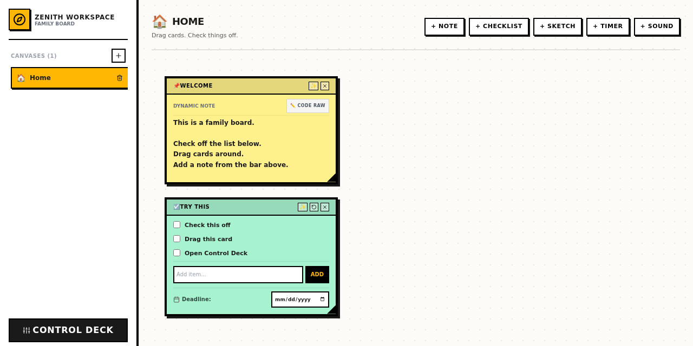
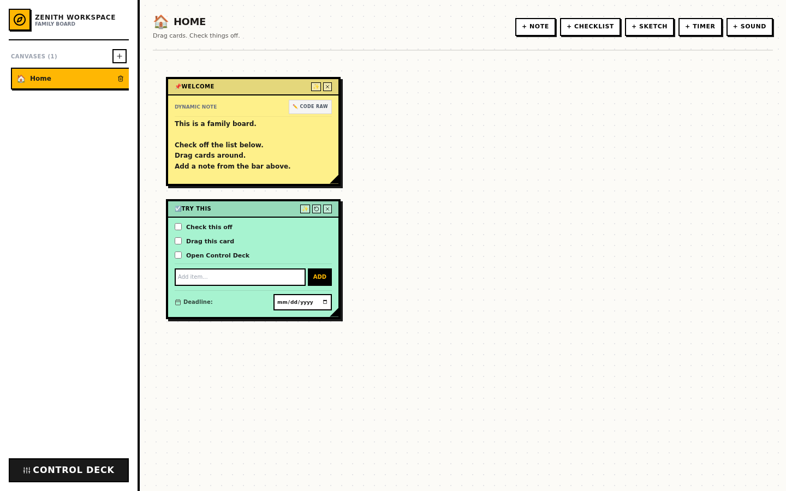
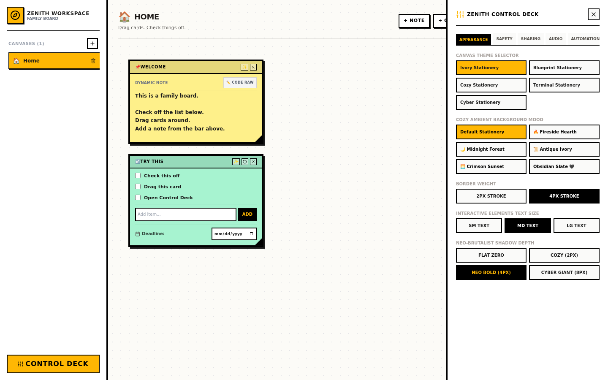

# Zenith Canvas

Neo-brutalist family canvas workspace — drag-and-drop bento cards, client-side persistence, Web Audio chimes, and a 4-digit PIN vault.

[](https://zenith-workspace-ten.vercel.app)
[](https://github.com/devtechedge/zenith-canvas/actions/workflows/ci.yml)
[](https://nextjs.org/)
[](https://www.typescriptlang.org/)
[](https://tailwindcss.com/)
[](LICENSE)

---

## Live Demo

**https://zenith-workspace-ten.vercel.app**

[](https://zenith-workspace-ten.vercel.app)

Do **not** use https://zenith-canvas.vercel.app or https://zenith-workspace.vercel.app — those hostnames are not this project.

> **Status:** Client-side only. Canvases, checklists, sketches, guest passes and the vault PIN live in `localStorage`. There is no account system, no database, and no production backend. Do not store secrets on the board.

---

## Screenshots

<p align="center">
  
</p>

| Workspace | Control Deck |
|-----------|----------------|
|  |  |

---

## Features

- Absolute-positioned family canvas with drag, resize, and multi-canvas switching
- Checklist, note, sketch, countdown, and ambient-sound cards
- Direct-DOM drag/resize so pointer moves do not re-render the React tree
- Web Audio chimes and a client-side 4-digit PIN vault (Control Deck)
- CSV / text drop import with formula-injection sanitization (`= + - @` → quoted)
- Demo “Fresh Start” reset in Control Deck → Automations

---

## Tech Stack

| Layer | Technology |
|-------|------------|
| Frontend | Next.js 14 (App Router), React 18, TypeScript, Tailwind CSS 3, Lucide |
| Data | Browser `localStorage` (no database) |
| Auth | None. Demo PIN is a client-side UX gate — see [SECURITY.md](SECURITY.md) |
| Audio | Native Web Audio API |
| Hosting | Vercel (import this repo; do not use `output: "standalone"`) |
| CI | GitHub Actions (unit + typecheck + Playwright) |

---

## Quick Start

```bash
npm install
npm run dev
```

Open http://localhost:3000

```bash
npm test            # unit (CSV sanitizer, PIN, stars, guest passes)
npm run typecheck
npm run test:e2e    # Playwright Chromium smokes (shell, Control Deck, check-off, Fresh Start)
```

---

## License

MIT. See [LICENSE](LICENSE).
