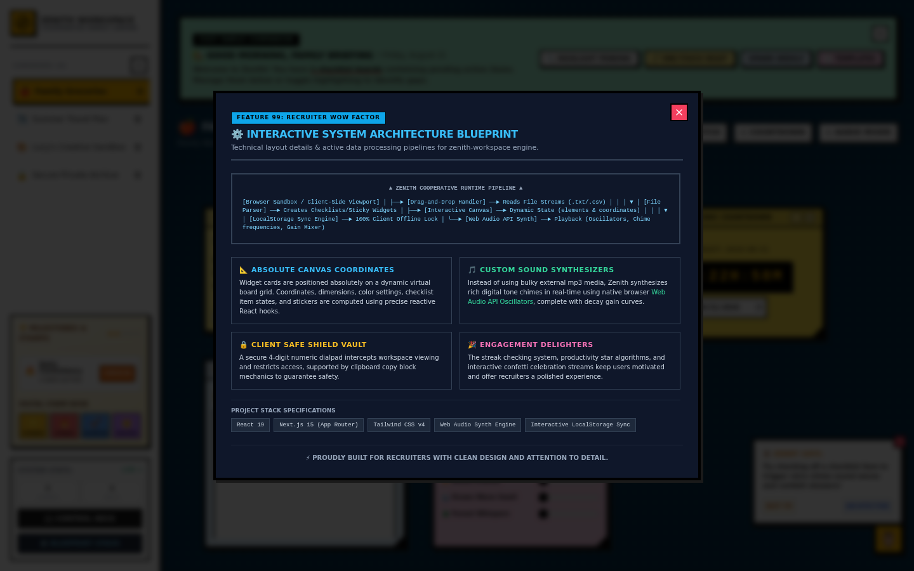

# Zenith Canvas

Neo-brutalist family canvas workspace — drag-and-drop bento cards, client-side persistence, Web Audio chimes, and a 4-digit PIN vault.

[](https://github.com/devtechedge/zenith-canvas/actions/workflows/ci.yml)
[](https://nextjs.org/)
[](https://www.typescriptlang.org/)
[](https://tailwindcss.com/)
[](LICENSE)

---

## Live Demo

Import this GitHub repo on Vercel (framework Next.js, build `next build`, no env vars). Intended production alias: **https://zenith-canvas.vercel.app**

> **Status:** Client-side only. Canvases, checklists, sketches, guest passes and the vault PIN live in `localStorage`. There is no account system, no database, and no production backend. Do not store secrets on the board.
>
> A Live Demo badge is omitted until the Vercel GitHub app is granted on this repo and a production alias is READY. Until then, `npm run dev` is the recruiter path.

---

## Screenshots

| Workspace | Control Deck |
|-----------|----------------|
|  |  |

| Blueprint |
|-----------|
|  |

---

## Features

- Absolute-positioned bento canvas with drag, resize, stickers, and multi-canvas switching
- Checklist, note, sketch, countdown, media, and ambient-sound cards
- Direct-DOM drag/resize so pointer moves do not re-render the React tree
- Web Audio chimes (single cached `AudioContext`) and confetti on milestones
- CSV / text drop import with formula-injection sanitization (`= + - @` → quoted)
- Client-side 4-digit PIN vault, guest-pass codes, and JSON backup export/import
- Recruiter “Fresh Start” reset plus an architecture-blueprint modal

---

## Tech Stack

| Layer | Technology |
|-------|------------|
| Frontend | Next.js 14 (App Router), React 18, TypeScript, Tailwind CSS 3, Lucide |
| Data | Browser `localStorage` (no database) |
| Auth | None. Demo PIN is a client-side UX gate — see [SECURITY.md](SECURITY.md) |
| Audio | Native Web Audio API |
| Hosting | Vercel (import this repo; do not use `output: "standalone"`) |
| CI | GitHub Actions (unit + typecheck + Playwright) |

---

## Quick Start

```bash
npm install
npm run dev
```

Open http://localhost:3000

```bash
npm test            # unit (CSV sanitizer, PIN, stars, guest passes)
npm run typecheck
npm run test:e2e    # Playwright Chromium smokes
```

---

## License

MIT. See [LICENSE](LICENSE).
